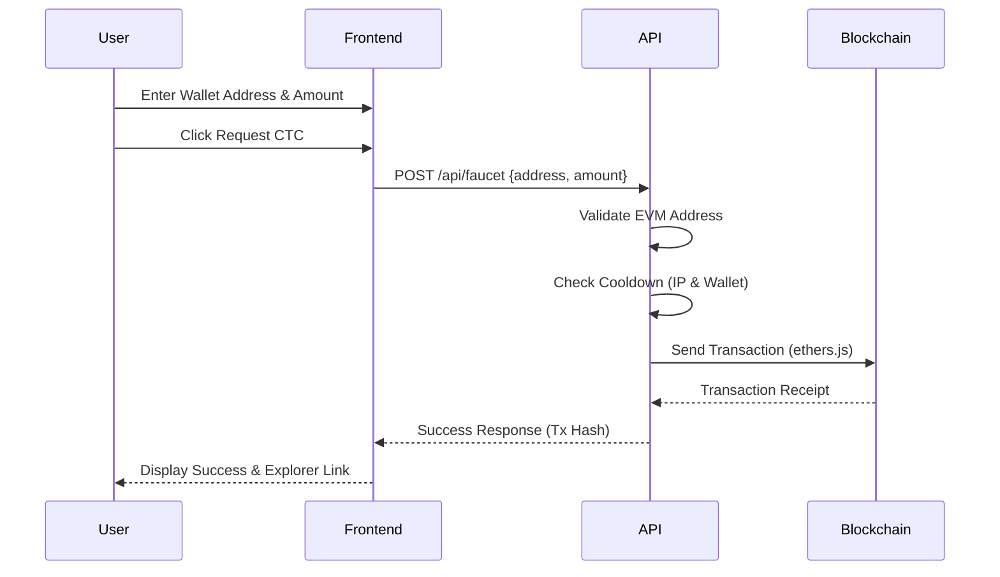
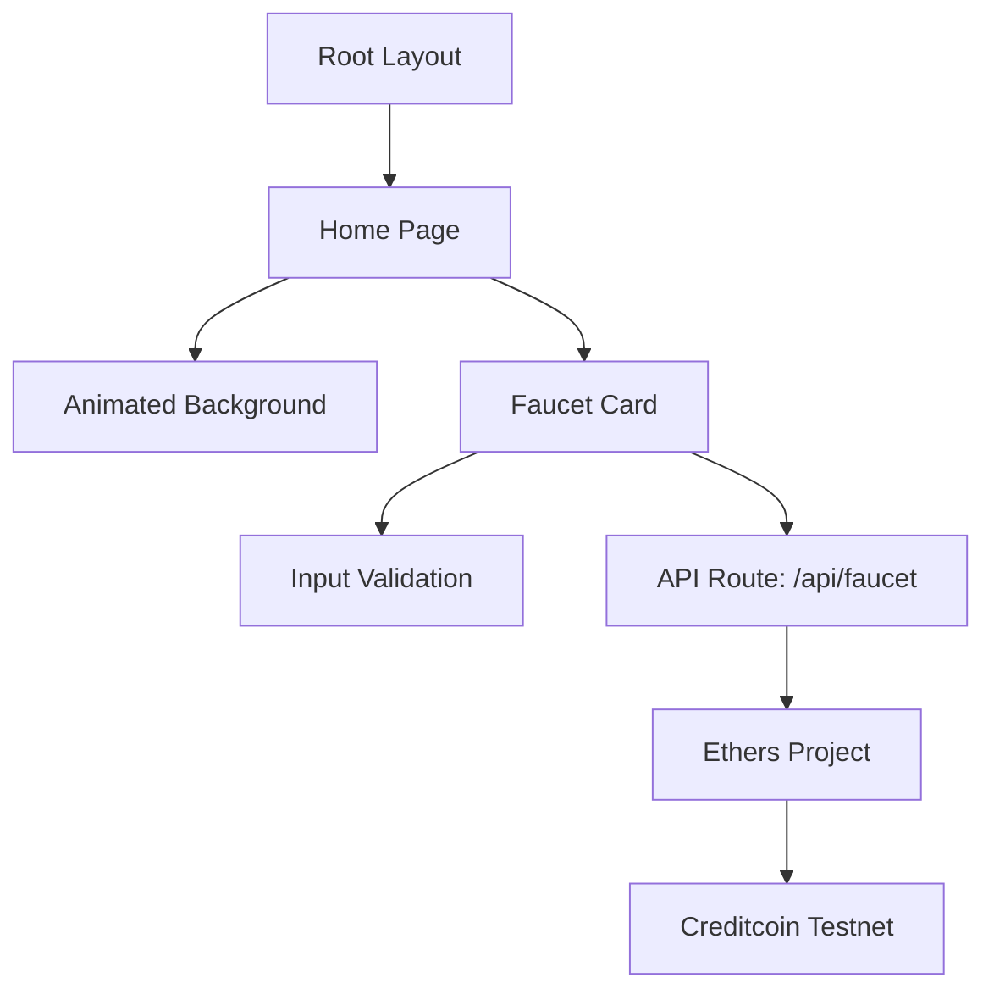

# Creditcoin Testnet Faucet

A faucet application for distributing Creditcoin Testnet tokens (CTC) to developers and testers.

## Features

- Modern Interface: Glassmorphism design with animated background components.
- Security: Rate limiting, input validation, and transaction handling.
- Social Connection: Direct link to follow @Creditcoin on X.
- Performance: Built with Next.js 16 and optimized for fast execution.
- Responsiveness: Designed for desktop and mobile environments.
- Web3 Integration: Ethereum/EVM integration via ethers.js.

## System Workflow



## Quick Start

### Prerequisites

- Node.js 18+ and npm
- A wallet with CTC on Creditcoin Testnet
- The private key for the faucet wallet

### Installation

1. Clone the repository:
```bash
git clone https://github.com/enliven17/credit-faucet.git
cd credit-faucet
```

2. Install dependencies:
```bash
npm install
```

3. Create .env file:
```bash
# .env
FAUCET_PRIVATE_KEY=0xYOUR_PRIVATE_KEY_HERE
```

4. Run the development server:
```bash
npm run dev
```

5. Access the application:
Visit http://localhost:3000

## Creditcoin Testnet Details

| Property | Value |
|----------|-------|
| Network Name | Creditcoin Testnet |
| RPC URL | https://rpc.cc3-testnet.creditcoin.network |
| Chain ID | 102031 |
| Currency Symbol | CTC |
| Block Explorer | https://creditcoin-testnet.blockscout.com/ |

## Application Architecture



## Usage

1. Follow Creditcoin: Use the follow link to stay updated on project news.
2. Enter Wallet Address: Provide a valid EVM wallet address.
3. Set Amount: Specify the amount of CTC required (within maximum limits).
4. Request CTC: Execute the transaction.
5. Verification: View the transaction status on the Blockscout explorer.

## Tech Stack

- Framework: Next.js 16 (App Router)
- Language: TypeScript
- Styling: Styled Components + Tailwind CSS
- Blockchain: Ethers.js v6
- Typography: Inter (Google Fonts)
- Animation: Custom WebGL shader

## Project Structure

```
src/
├── app/
│   ├── api/faucet/route.ts    # Request handling and validation
│   ├── layout.tsx              # Application structure
│   └── page.tsx                # Main entry point
├── components/
│   ├── AnimatedBackground.tsx  # Shader implementation
│   ├── FaucetCard.tsx          # Interface logic
│   └── ui/                     # Shared components
├── constants/
│   └── creditcoin.ts           # Chain parameters
├── utils/
│   └── validation.ts           # Validation logic
└── theme/                      # Styling definitions
```

## Security Implementation

- IP-based rate limiting (5 requests per window)
- 1-hour cooldown period per IP address
- 1-hour cooldown period per wallet address
- EVM address format validation
- Transaction amount clamping
- Secure environment variable storage for private keys
- Error handling for blockchain network issues

## API Reference

### POST /api/faucet

Request:
```json
{
  "address": "0x742d35Cc6634C0532925a3b844Bc9e7595f0bEb",
  "amount": 100
}
```

Success Response:
```json
{
  "ok": true,
  "hash": "0x123...",
  "explorer": "https://creditcoin-testnet.blockscout.com/tx/0x123...",
  "status": 1
}
```

Error Response:
```json
{
  "error": "Invalid address"
}
```

## Deployment

### Vercel

1. Push the code to a Git repository.
2. Import the project in the Vercel dashboard.
3. Configure the FAUCET_PRIVATE_KEY environment variable.
4. Deploy the application.

## Contribution

Contributions are accepted via Pull Requests. Ensure code consistency and test coverage before submission.

## License

MIT License.

## Maintenance

Maintained by [enliven](https://github.com/enliven17)

## Resources

- [Creditcoin Documentation](https://docs.creditcoin.org/)
- [Creditcoin Testnet Explorer](https://creditcoin-testnet.blockscout.com/)
- [Next.js Reference](https://nextjs.org/docs)

---

Developed for the Creditcoin community.
