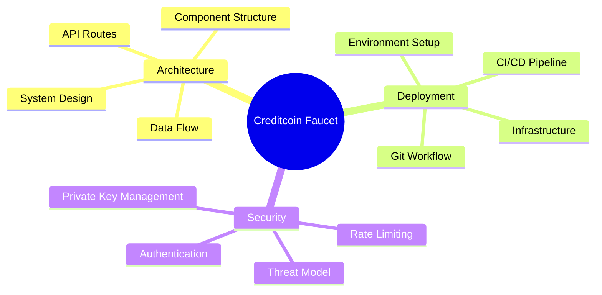
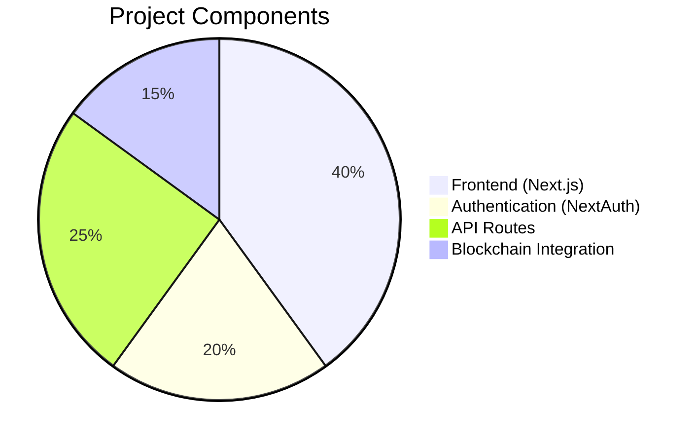
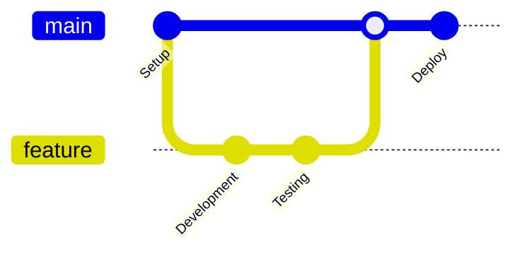

# Documentation

This directory contains comprehensive documentation for the Creditcoin Testnet Faucet project.

## 📋 Documentation Index

### [Architecture](./architecture.md)
- System architecture overview
- Component structure
- API routes mapping
- Data flow diagrams

### [Deployment](./deployment.md)
- Deployment workflow
- Environment setup
- CI/CD pipeline
- Infrastructure overview

### [Security](./security.md)
- Authentication flow
- Rate limiting system
- Security layers
- Threat model and mitigations

## 🎯 Quick Navigation

## 📊 Project Overview

## 🔄 Development Workflow

## 🚀 Getting Started

1. **Architecture** - Understand the system design
2. **Security** - Review security measures
3. **Deployment** - Follow deployment guide

Each document contains detailed Mermaid diagrams for visual understanding of the system components and workflows.