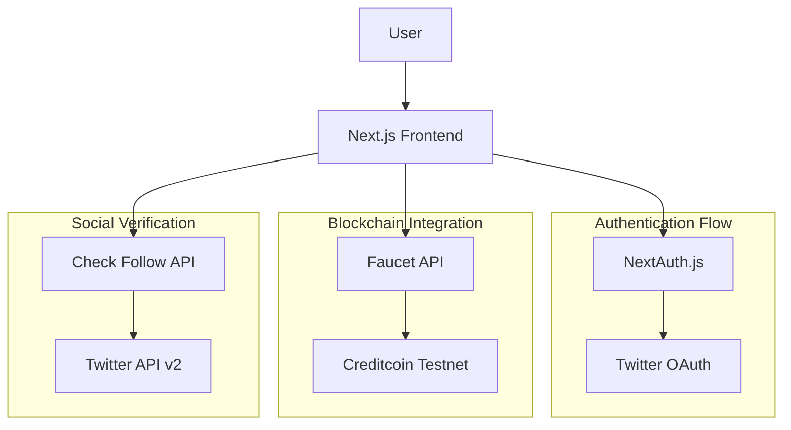
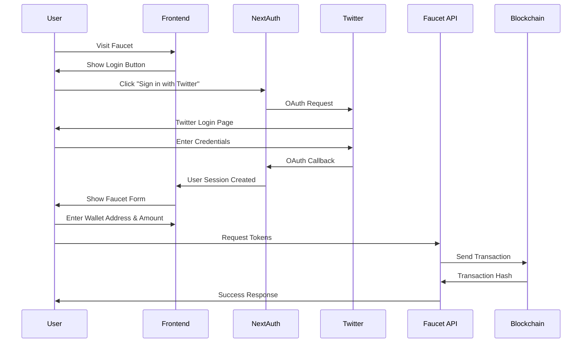
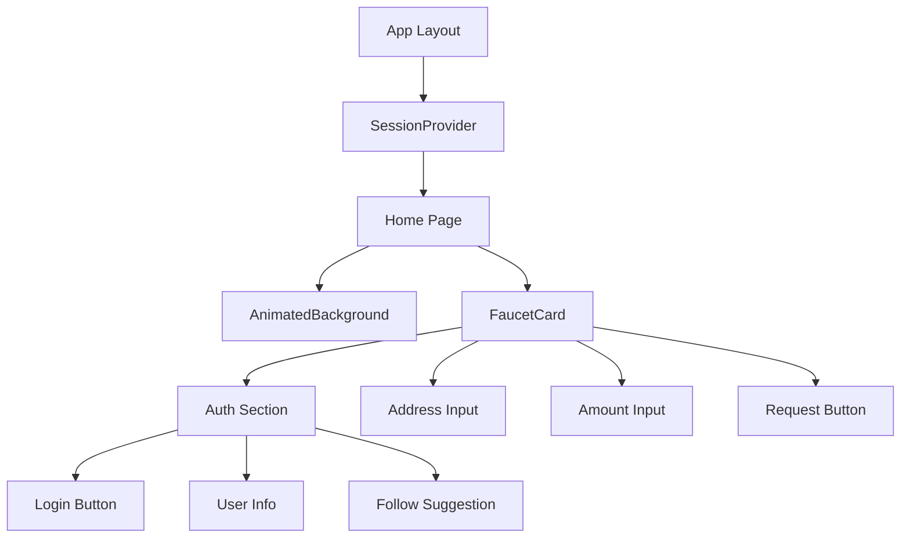
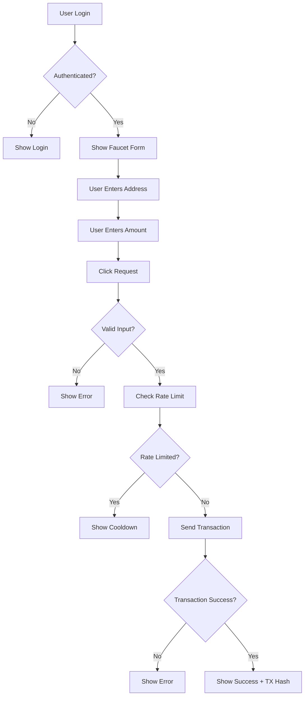

# Creditcoin Faucet Architecture

## System Architecture



## User Flow



## Component Structure



## API Routes

```mermaid
graph LR
    A[API Routes] --> B[/api/auth/[...nextauth]]
    A --> C[/api/faucet]
    A --> D[/api/check-follow]
    
    B --> E[Twitter OAuth Handler]
    C --> F[Token Distribution]
    D --> G[Follow Status Check]
    
    F --> H[Creditcoin Network]
    G --> I[Twitter API v2]
```

## Data Flow

