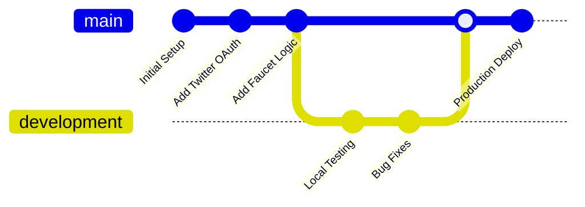
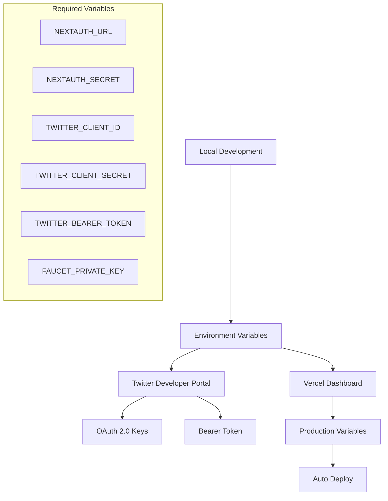
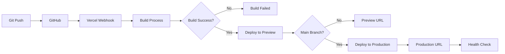
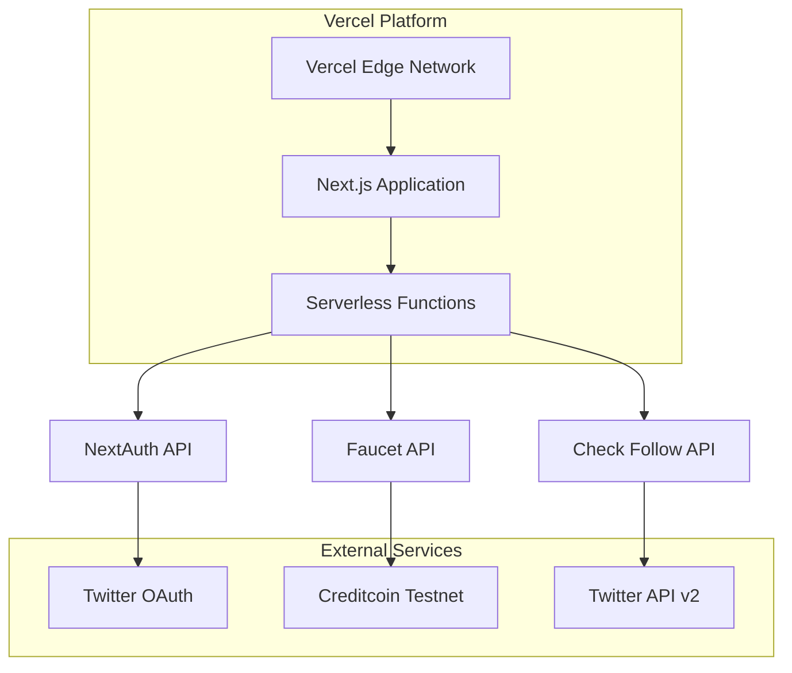

# Deployment Guide

## Deployment Flow

```mermaid
gitGraph
    commit id: "Initial Setup"
    commit id: "Add Twitter OAuth"
    commit id: "Add Faucet Logic"
    branch development
    commit id: "Local Testing"
    commit id: "Bug Fixes"
    checkout main
    merge development
    commit id: "Production Deploy"
```

## Environment Setup

```mermaid
graph TB
    A[Local Development] --> B[Environment Variables]
    B --> C[Twitter Developer Portal]
    B --> D[Vercel Dashboard]
    
    C --> E[OAuth 2.0 Keys]
    C --> F[Bearer Token]
    
    D --> G[Production Variables]
    G --> H[Auto Deploy]
    
    subgraph "Required Variables"
        I[NEXTAUTH_URL]
        J[NEXTAUTH_SECRET]
        K[TWITTER_CLIENT_ID]
        L[TWITTER_CLIENT_SECRET]
        M[TWITTER_BEARER_TOKEN]
        N[FAUCET_PRIVATE_KEY]
    end
```

## CI/CD Pipeline

```mermaid
flowchart LR
    A[Git Push] --> B[GitHub]
    B --> C[Vercel Webhook]
    C --> D[Build Process]
    
    D --> E{Build Success?}
    E -->|No| F[Build Failed]
    E -->|Yes| G[Deploy to Preview]
    
    G --> H{Main Branch?}
    H -->|No| I[Preview URL]
    H -->|Yes| J[Deploy to Production]
    
    J --> K[Production URL]
    K --> L[Health Check]
```

## Infrastructure

```mermaid
graph TB
    A[Vercel Edge Network] --> B[Next.js Application]
    B --> C[Serverless Functions]
    
    C --> D[NextAuth API]
    C --> E[Faucet API]
    C --> F[Check Follow API]
    
    D --> G[Twitter OAuth]
    E --> H[Creditcoin Testnet]
    F --> I[Twitter API v2]
    
    subgraph "External Services"
        G
        H
        I
    end
    
    subgraph "Vercel Platform"
        A
        B
        C
    end
```