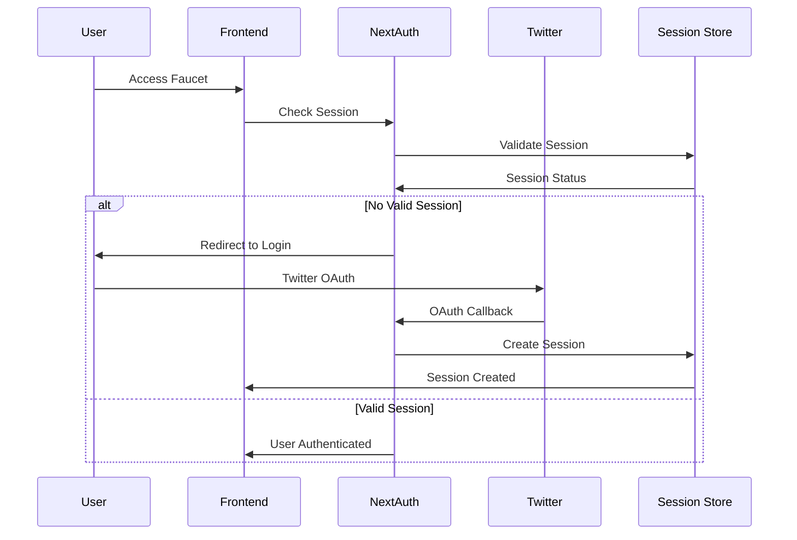
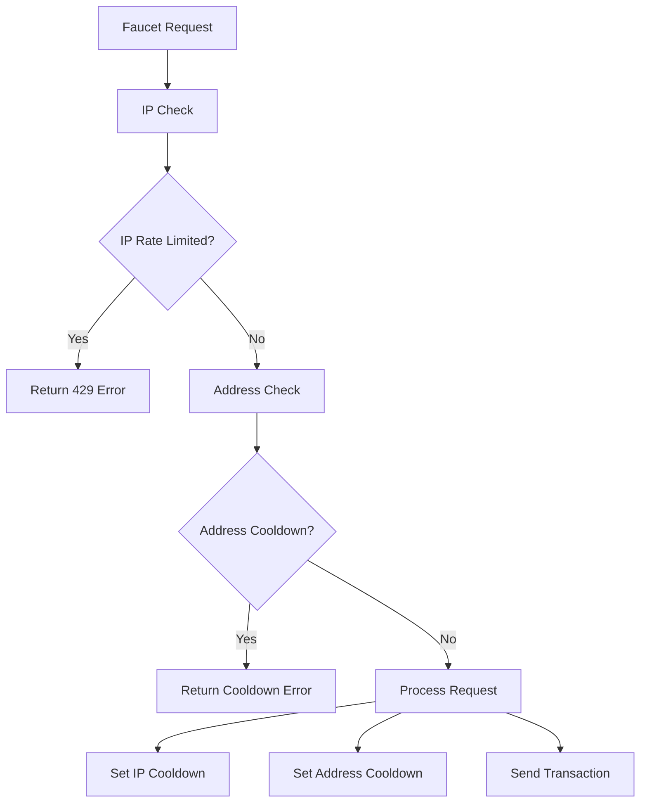
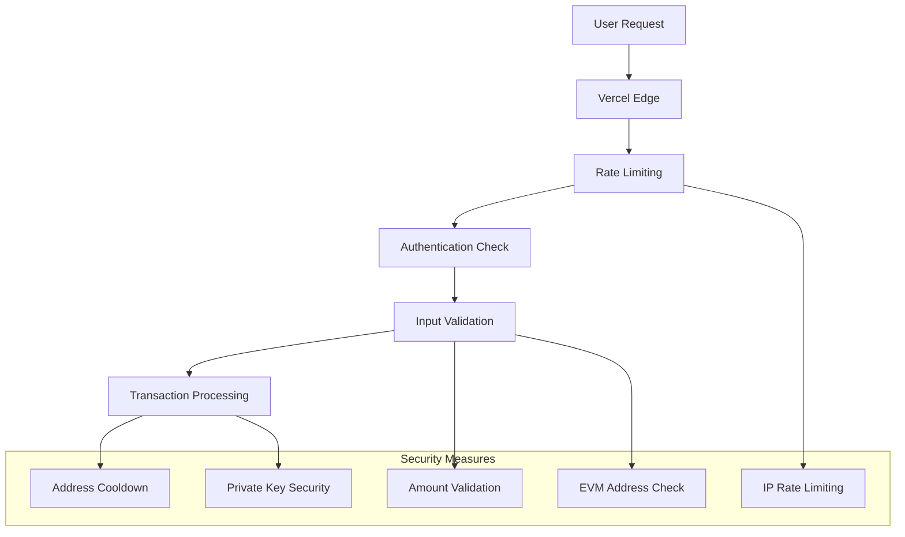
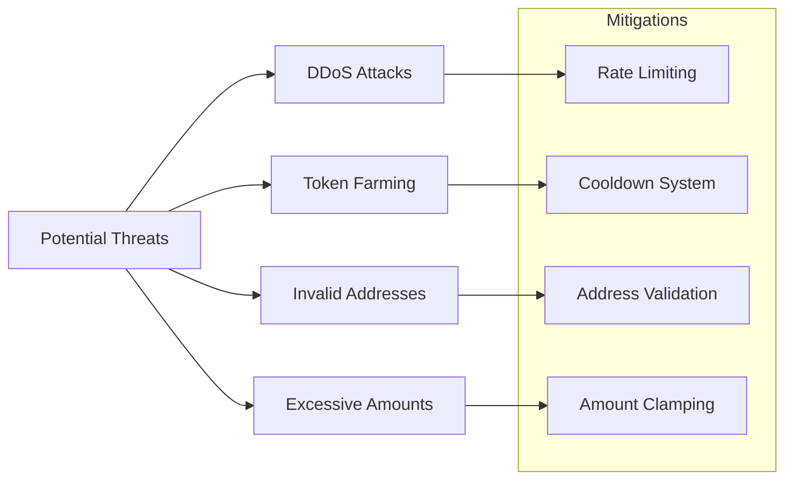
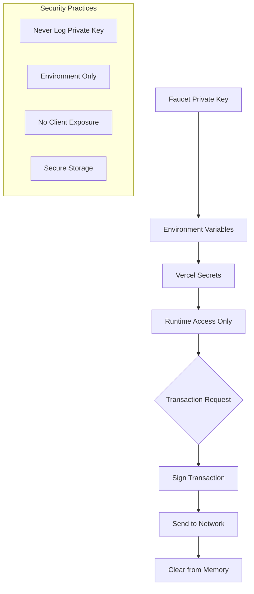

# Security Architecture

## Authentication Flow

```mermaid
sequenceDiagram
    participant U as User
    participant F as Frontend
    participant N as NextAuth
    participant T as Twitter
    participant S as Session Store
    
    U->>F: Access Faucet
    F->>N: Check Session
    N->>S: Validate Session
    S->>N: Session Status
    
    alt No Valid Session
        N->>U: Redirect to Login
        U->>T: Twitter OAuth
        T->>N: OAuth Callback
        N->>S: Create Session
        S->>F: Session Created
    else Valid Session
        N->>F: User Authenticated
    end
```

## Rate Limiting System

```mermaid
graph TD
    A[Faucet Request] --> B[IP Check]
    B --> C{IP Rate Limited?}
    C -->|Yes| D[Return 429 Error]
    C -->|No| E[Address Check]
    
    E --> F{Address Cooldown?}
    F -->|Yes| G[Return Cooldown Error]
    F -->|No| H[Process Request]
    
    H --> I[Set IP Cooldown]
    H --> J[Set Address Cooldown]
    H --> K[Send Transaction]
```

## Security Layers

```mermaid
graph TB
    A[User Request] --> B[Vercel Edge]
    B --> C[Rate Limiting]
    C --> D[Authentication Check]
    D --> E[Input Validation]
    E --> F[Transaction Processing]
    
    subgraph "Security Measures"
        G[IP Rate Limiting]
        H[Address Cooldown]
        I[Amount Validation]
        J[EVM Address Check]
        K[Private Key Security]
    end
    
    C --> G
    F --> H
    E --> I
    E --> J
    F --> K
```

## Threat Model

```mermaid
graph LR
    A[Potential Threats] --> B[DDoS Attacks]
    A --> C[Token Farming]
    A --> D[Invalid Addresses]
    A --> E[Excessive Amounts]
    
    B --> F[Rate Limiting]
    C --> G[Cooldown System]
    D --> H[Address Validation]
    E --> I[Amount Clamping]
    
    subgraph "Mitigations"
        F
        G
        H
        I
    end
```

## Private Key Management

```mermaid
flowchart TD
    A[Faucet Private Key] --> B[Environment Variables]
    B --> C[Vercel Secrets]
    C --> D[Runtime Access Only]
    
    D --> E{Transaction Request}
    E --> F[Sign Transaction]
    F --> G[Send to Network]
    G --> H[Clear from Memory]
    
    subgraph "Security Practices"
        I[Never Log Private Key]
        J[Environment Only]
        K[No Client Exposure]
        L[Secure Storage]
    end
```